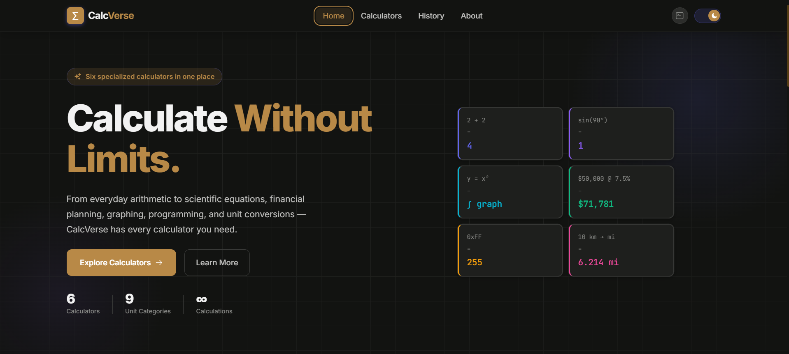
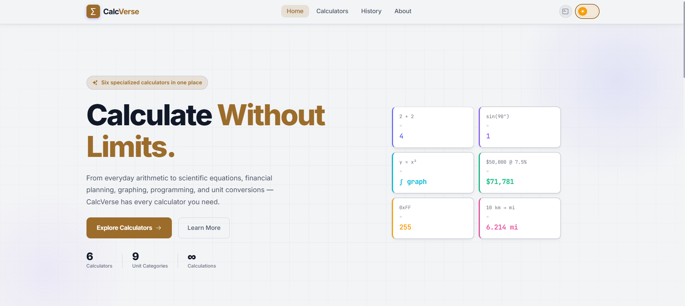
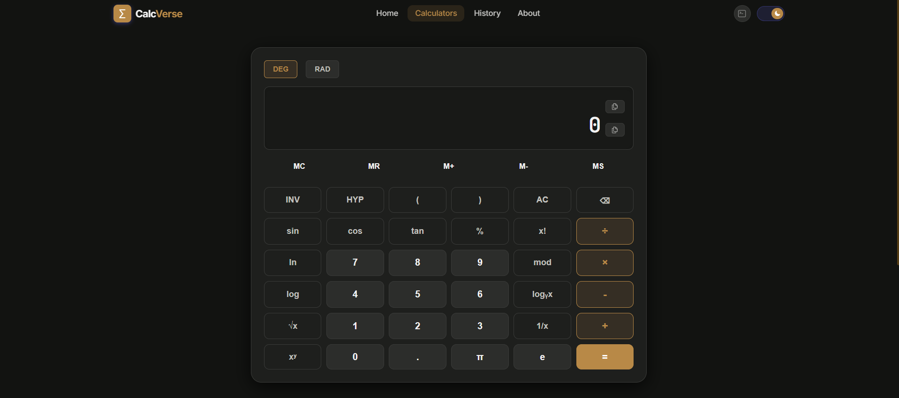
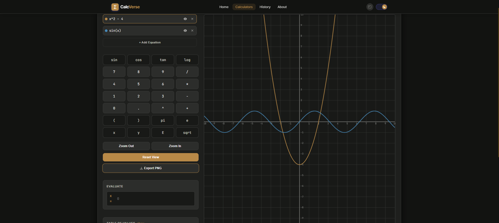
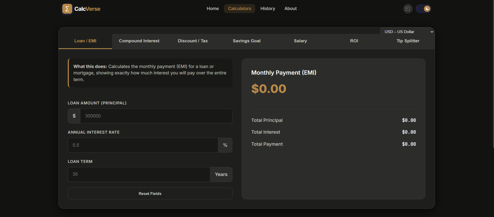
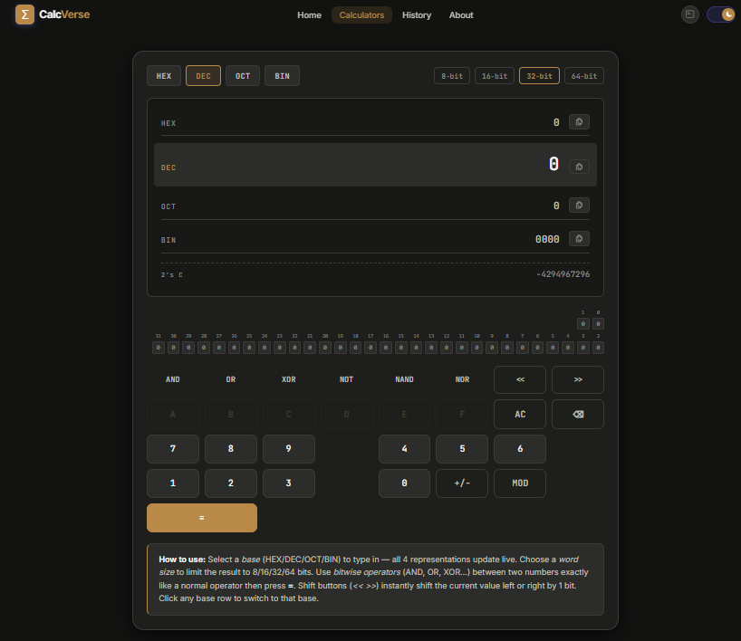
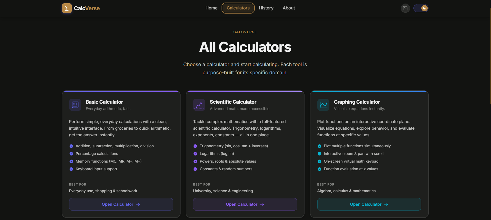
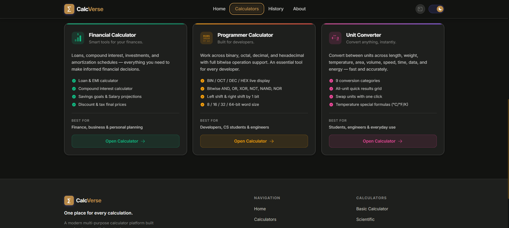
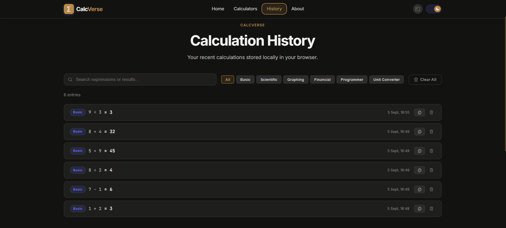

<div align="center">

# CalcVerse


**CalcVerse** is a modern, unified calculator platform designed as a developer portfolio project. Rather than a single tool, it bundles six specialized calculators into one sleek, unified interface.

Built with React 18 and Vite, it focuses on providing a premium user experience through beautiful design, fluid interactions, and deep functionality.


<br/>


</div>

## 🚀 Features

### 1. Basic Calculator

A clean, everyday calculator with standard arithmetic operations and a dedicated memory row (`MC`, `MR`, `M+`, `M-`). It tracks your running calculations in a visual history ribbon above the current input.

### 2. Scientific Calculator

Designed for advanced mathematics, featuring:
- Trigonometric functions (`sin`, `cos`, `tan`, `arcsin`, etc.) with `DEG` / `RAD` toggles.
- Advanced functions (`log`, `ln`, `e`, `π`, roots, exponents).
- An **Unclosed Parentheses Warning** badge to help avoid syntax errors.

### 3. Graphing Calculator

A real-time function plotter powered by `mathjs` and HTML5 Canvas.
- Plot multiple equations simultaneously with distinct colors.
- Interactive panning and zooming.
- **Evaluate Panel**: Instantly find `y` for a given `x`.
- **Table of Values**: Generate a scrollable data table for a range of `x` values.
- **Export**: Download your graph canvas as a PNG.

### 4. Financial Calculator

A comprehensive suite for personal finance planning:
- **Loan / EMI**: Calculate monthly payments and generate an Amortization Schedule (exportable as CSV).
- **Compound Interest**: Predict future value based on varied compounding frequencies.
- **Discount & Tax**: Quickly find final prices after applying markups/discounts.
- **Savings Goal**: Calculate required monthly contributions to hit a target amount.
- **Tip Splitter**: Split bills easily among friends.
- Support for multiple global currencies.

### 5. Programmer Calculator

A specialized tool for developers handling bitwise logic:
- **Multi-Base Live Display**: See inputs evaluated simultaneously in HEX, DEC, OCT, and BIN.
- **Bitwise Operations**: `AND`, `OR`, `XOR`, `NOT`, and bit shifting (`<<`, `>>`).
- **Dynamic Word Sizing**: Toggle between 8-bit, 16-bit, 32-bit, and 64-bit boundaries.
- **Bit-Map Visualizer**: A clickable grid of 64 bits to flip individual bits manually.
- **Two's Complement** representations for signed integers.

### 6. Unit Converter

Convert across 10 different categories (Length, Weight, Temp, Area, Volume, Speed, Time, Data, Energy, and Currency).
- **Live Currency Rates**: Fetches real-time exchange rates from `open.er-api.com`.
- **Quick Results Grid**: See conversions for *all* units in a category at once.
- **Favourites System**: Pin frequently used units for quick access (persisted in LocalStorage).

### Global App Features

- **Calculation History Page**: A dedicated page storing all your calculations. You can search, filter by calculator type, copy results, and clear history.
- **Universal Keyboard Shortcuts**: A quick-access modal (`?` key) lists shortcuts for navigating and using the app.
- **Persistent Theme**: Toggle between Dark and Light mode (persisted in LocalStorage).


<br/>


## 🛠️ Tech Stack

- **Framework**: React 18
- **Build Tool**: Vite
- **Routing**: React Router v6
- **Styling**: Vanilla CSS Modules (no Tailwind)
- **Icons**: `react-icons`
- **Math Engine**: `mathjs` (used for scientific evaluation and graphing)

## 📦 Installation & Setup

1. Clone the repository:
   ```bash
   git clone https://github.com/umandathathsarani/CalcVerse.git
   cd CalcVerse
   ```

2. Install dependencies:
   ```bash
   npm install
   ```

3. Start the development server:
   ```bash
   npm run dev
   ```

4. Build for production:
   ```bash
   npm run build
   ```

## 📜 License
This project is licensed under the MIT License.
